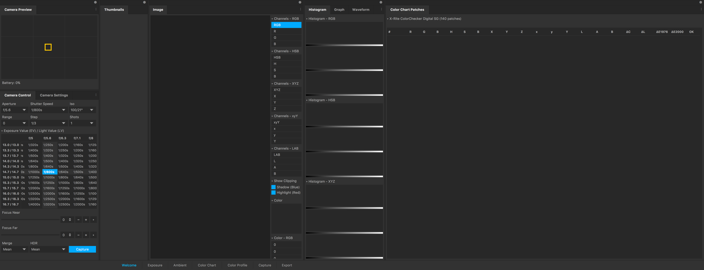
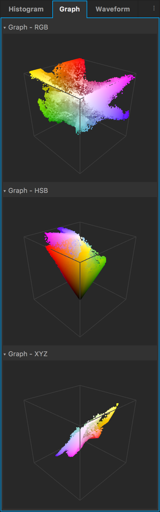
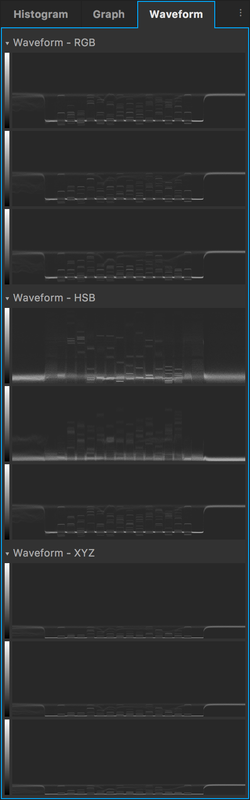

# Capture3

Capture3 is a C++ desktop application that can capture and process photos through a tethered connection with a digital camera.
It started out as a research project to learn more about digital camera's, image processing, color spaces, C++, OpenCV and multi-threading. 
The main features are:

1. **Tethered capturing:** Automatically capture multiple photos with different [exposure values](https://en.wikipedia.org/wiki/Exposure_value) and focus planes, without touching the camera.
2. **Automatic color calibration:** This works by detecting a [X-Rite ColorChecker Digital SG](http://xritephoto.com/colorchecker-digital-sg) target in a photo, then automatically detecting each of the 140 colored patches and calculating a white point and color matrix from these values. 
3. **Exposure merging:** Merge photos with different exposure brackets to create a [HDR](https://en.wikipedia.org/wiki/High-dynamic-range_imaging) image.
4. **Focus merging:** Merge photos with different focal planes through a technique called [focus stacking](https://en.wikipedia.org/wiki/Focus_stacking) to create one result image with a higher DOF (Depth Of Field).
5. **Color space visualizer:** Preview images in [RGB](https://en.wikipedia.org/wiki/RGB_color_space), [HSB](https://en.wikipedia.org/wiki/HSL_and_HSV), [XYZ](https://en.wikipedia.org/wiki/CIE_1931_color_space) and [LAB](https://en.wikipedia.org/wiki/Lab_color_space) color spaces, including [3D color space graphs](screenshots/screenshot-panel-graph.png).

Capture3 is developed using [JetBrains CLion](https://www.jetbrains.com/clion/) and can be build on a Mac with macOS Sierra or higher.
Although it could support other camera's, it only tested using a [Nikon D3300](http://imaging.nikon.com/lineup/dslr/d3300/) and [Sigma 35mm f/1.4 DG HSM Art](https://www.sigmaphoto.com/lenses/standard-lenses/35mm-f14-dg-hsm-a) lens.

## Learn more
- [Qt5](https://www.qt.io) → Application framework used to create the GUI
- [OpenCV](http://opencv.org) → Image processing library
- [OpenMP](http://www.openmp.org) → Amazing multi-threading library
- [Imatest](http://www.imatest.com/docs/) → Great resource on color targets and color matrix calculations
- [Bruce Lindbloom](http://www.brucelindbloom.com) → Great resource color space math
- [Oscar de Lama](http://www.odelama.com/photo/) → Great resource on RAW processing

## Screenshots






## Requirements
- [Qt 5.9](https://www.qt.io)
- [NodeJS v8.5](https://nodejs.org)

## Libraries
- autoconf 2.69
- automake 1.15
- gcc 4.9.4
- gcc 6.3.0
- gettext 0.19.8.1
- libiconv 1.14
- libtool 2.4.6
- mpc 1.0.3
- readline v6.3
- sed 4.2.2
- isl 0.12.2
- isl 0.16.1
- eigen 3.3.1
- tiff 4.0.7
- boost 1.63.0
- freeimage 3.17.0
- freetype 2.7.1
- gphoto2 2.5.11
- libgphoto2 2.5.11
- lcms2 2.8
- libexif 0.6.21
- libpng 1.6.27
- libusb 1.0.21
- libusb-compat 0.1.5
- pcre 8.39
- ffmpeg 3.2.2
- glfw 3.2.1
- libffi 3.2.1
- libgd 2.1.1
- opencv 3.2.0
- opencv_contrib 3.2.0
- gmp 6.1.2
- popt 1.16
- cloog 0.18.4
- cairo 1.14.8
- pixman 0.34.0
- fontconfig 2.12.1
- pkg-config 0.29.1
- jpeg 9b
- libraw 0.18.0
- libraw-demosaic-pack-GPL2 0.18.0
- libraw-demosaic-pack-GPL3 0.18.0
- mpfr 3.1.5
- nasm 2.12.02
- openssl 1.1.0c

## Run
```shell
./debug.sh
```

## Release
```shell
./release.sh
```
